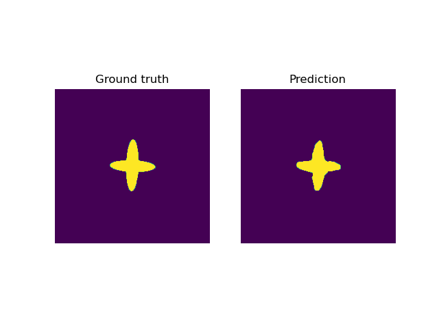

# Submission to the KTC 2023

For this submission, we developed a postprocessing **FC-UNet** for EIT segmentation. The postprocessing network is trained on a dataset of synthetic phantoms and simulated measurements and finetuned on the four challenge phantoms. The network architecture inspired by the work of [Z. Chen et al.](https://ieeexplore.ieee.org/document/9128764?denied=).

# Table of contents 
1. [Usage](#usage)
2. [Method](#method)
3. [Examples](#examples)
4. [Evaluation](#evaluation)
5. [Authors](#authors)

## Usage

We provide the `enviroment.yml` file to restore the conda enviroment used for the submission. You can create the environment using the following command:

```
conda env create -f environment.yml
```

The network weights are stored [here](https://seafile.zfn.uni-bremen.de/d/f22fb47500f34b0fb5c2/) and have to be placed in the folder *fcunet_model*. The script `main.py` can be used to reconstruct phantoms: 

```
python main.py /path_to_input_folder /path_to_ouput_folder difficulty_level
```


### Enviroment


## Method

Our goal is to train a postprocessing UNet, 

$$ f_\theta(U - U_\text{ref}) \approx \sigma_\text{segmentation} $$

to predict the segmentation of the conductivity $\sigma$ based the difference measurements. We directly represent the segmentation map on a $256 \times 256$ pixel grid. The input to this network is the full measurement vector with $2356$ ($76$ patterns, $31$ meauserements per pattern) elements. We first use a linear layer to map the input to a $64 \times 64$ image and use a bilinear upsampling to $256 times 256$px. The rest of the network is a standard UNet. For the higher levels in the challenge, measurements are missing. These are just filled with zeros in our approach.

Note that the backbone of our approach used exactly the same UNet architecture as in our other repository.

### Training

To deal with the different difficulty levels of the challenge, we added the level $l$ as an additional input to the model, i.e.

$$ f_\theta(U - U_\text{ref}, l) \approx \sigma_\text{segmentation}. $$

In a first training phase, we only train the initial linear layer. In the next phase, we train the full network for semgentation. Both of these training phases use simulated measurements. As we noticed, that the performance was lacking, we implemented a last finetuning phase (using a small learning rate) and trained the full network on the four challenge phantoms with the provided measurements. The results shown in the *Examples* section might thus be overly optimistic and the model may be overfitted to the challenge data.


### Synthetic Training Data

For simulation, we used the forward operator provided by the organisers with the dense mesh. We create synthetic conductivity images to train the FCUNet. For this, we simulate a random number (1 to 4) of objects inside the water tank. In this context, we use circles, random polygons, and hand-drawn objects. We ensure that these elements do not intersect or overlap. Each object is then randomly assigned to be either conductive or resistive. Using this method, we create ~15.000 images per challenge level.

## Examples


### Level 1

<p float="left">
  
  
</p>

<p float="left">
  
  
</p>

### Level 2

<p float="left">
  
  
</p>

<p float="left">
  
  
</p>


### Level 3

<p float="left">
  
  
</p>

<p float="left">
  
  
</p>

### Level 4

<p float="left">
  
  
</p>

<p float="left">
  
  
</p>

### Level 5

<p float="left">
  
  
</p>

<p float="left">
  
  
</p>

### Level 6

<p float="left">
  
  
</p>

<p float="left">
  
  
</p>

### Level 7

<p float="left">
  
  
</p>

<p float="left">
  
  
</p>

## Evaluation

We evaluate the postprocessing UNet w.r.t. the [score function](https://www.fips.fi/KTC2023_Instructions_v3_Oct12.pdf) used in the challenge. As this model was finetuned on the challenge data these results might be overly optimistic. In the following we present the mean score over the four challenge phantoms:


| Level         |    Score       |
|---------------|----------------|
| 1             | $0.988$       |
| 2             | $0.990$       |
| 3             | $0.989$       |
| 4             | $0.989$       |
| 5             | $0.989$       |
| 6             | $0.986$       |
| 7             | $0.985$       |


## Authors

- Alexander Denker<sup>1</sup>, Tom Freudenberg<sup>1</sup>, Željko Kereta<sup>2</sup>, Imraj RD Singh<sup>2</sup>, Tobias Kluth<sup>1</sup>, Peter Maass<sup>1</sup>, Simon Arridge <sup>2</sup>

<sup>1</sup>Center of Industrial Mathematics (ZeTeM), University of Bremen, Bibliothekstr. 5, 28359 Bremen, Germany.

<sup>2</sup>Department of Computer Science, University College London, 66-72 Gower St, WC1E 6EA, London, United Kingdom.
